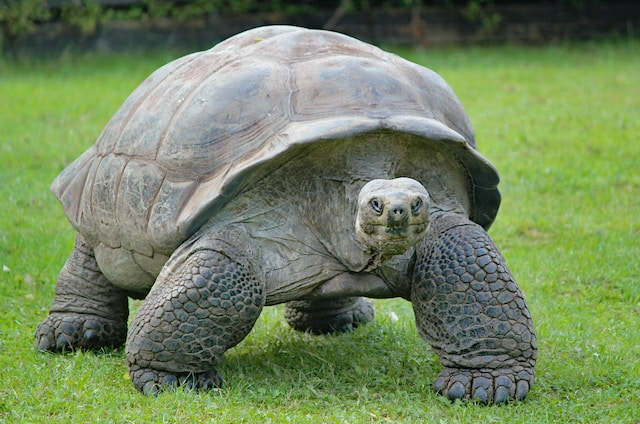
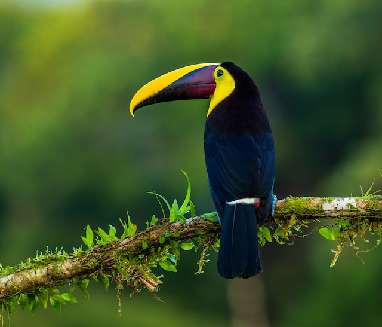

**The Age Paradox: Comparing Human Years to Animal Years**

When we celebrate a birthday, we mark the completion of another year of life. For humans, this annual event is a universal way to measure age. However, when it comes to animals, the concept of age and its implications can be quite different. Let's delve into the fascinating world of age, comparing human years to animal years.

### 1. **The Dog Year Myth**

Most of us have heard the adage that one human year is equivalent to seven dog years. While this is a popular belief, it's an oversimplification. Dogs mature faster than humans, so their first year can be likened to 15 human years. By the time a dog is two, it would have aged about 24 human years. After that, each dog year can be equated to approximately 4-5 human years. Moreover, smaller breeds tend to live longer than larger breeds, so their age conversion can differ.

### 2. **Cats: The Independent Teenagers**

Cats mature quickly in their first couple of years. A one-year-old cat is developmentally similar to a 15-year-old human, and by two, a cat is around 24 in human years. After this rapid growth phase, cats age about four human years for every one cat year.

### 3. **The Brief Lives of Rodents**

Rodents like mice and rats have much shorter lifespans compared to larger mammals. A one-year-old mouse is already a senior, equivalent to a human in their 60s! This rapid aging is one reason why rodents are often used in scientific research; their entire life cycle can be observed in a relatively short period.

### 4. **Tortoises: The Centenarians of the Animal Kingdom**

Contrary to rodents, tortoises are known for their long lifespans. Some species can live for over a century! However, they mature slowly. A 25-year-old tortoise might still be considered young, not reaching full maturity until they're 40 or 50.

### 5. **Birds: Defying Age Stereotypes**

Birds, especially parrots and eagles, can live surprisingly long lives. Some parrots can live up to 80 years, making them lifelong companions for their human caretakers. Their age progression isn't linearly comparable to humans, but it's safe to say that a 5-year-old parrot is not an "old bird."

### 6. **Age and Size in the Animal Kingdom**

Interestingly, in many species, size and lifespan are inversely related. Elephants, one of the largest land animals, can live up to 70 years, while many small mammals live only a few years. However, there are exceptions, like the bowhead whale, which can live over 200 years!

### **Conclusion**

Age is more than just a number, especially when comparing across species. While humans have standardized age milestones like adolescence, adulthood, and seniority, animals follow a different, species-specific timeline. This diversity is a testament to the wonders of evolution and adaptation. The next time you celebrate a pet's birthday, remember that they might be hitting a different life milestone than you'd expect!
